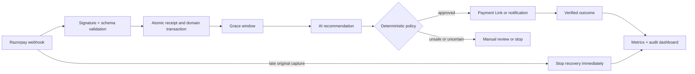

# Recoup — RecoverAI

**Failed-Payment Recovery Autopilot · Razorpay AI Buildathon · Track 3**

**Live Demo:** [https://recoup-recoverai.vercel.app](https://recoup-recoverai.vercel.app)

Recoup turns failed Razorpay payments into bounded, auditable recovery cases for Indian D2C merchants. It verifies provider events, waits through a late-capture grace window, asks an AI agent for a structured recommendation, lets deterministic policy authorize the action, creates a test-mode Payment Link when safe, and stops recovery the moment the original payment succeeds.

The dashboard makes the outcome legible in one screen: revenue at risk, verified revenue recovered, recovery rate, duplicate collections prevented, case-level decisions, and a chronological audit trail.

## Why it matters

- **Revenue:** reports recovered rupees, not chatbot activity.
- **Safety:** the model proposes; policy code controls execution, limits, approval, and stopping rules.
- **Trust:** webhook ingestion and state changes are idempotent and transactional.
- **Evaluation:** a versioned 60-case simulator produces a reproducible benchmark with no real customer data.

## Five-minute local demo

```bash
git clone https://github.com/Anshumaan657/Recoup.git
cd Recoup
nvm use
npm ci
cp .env.example .env
npm run db:generate
npm run db:setup
npm run demo:replay
npm run dev
```

Open `http://localhost:3000`. The fixed dataset reports ₹1,24,840 at risk, ₹38,280 recovered, 20 recovered cases, 8 duplicate collections prevented, and a 30.6632% rupee recovery rate. Every result is labeled **synthetic**.

For the timed presentation, use [docs/DEMO_SCRIPT.md](docs/DEMO_SCRIPT.md).

## System flow



## Core guarantees

- HMAC-SHA256 verification before webhook processing; invalid signatures return `401`.
- Stable provider-event or payload-hash idempotency keys.
- Receipt, case, and audit mutations commit atomically or roll back together.
- Amount and currency must match before recovered revenue is recorded.
- Late capture closes an active recovery and records duplicate prevention.
- Model output is schema-validated and checked by deterministic guardrails.
- Missing, failed, timed-out, or unsafe model output uses an audited fallback.
- At most one bounded notification attempt per case in this MVP.
- Currency is stored as integer paise; demo identities are masked and synthetic.

## API

| Method | Endpoint | Purpose |
|---|---|---|
| `POST` | `/webhooks/razorpay` | Verify and ingest supported Razorpay events |
| `POST` | `/api/demo/replay` | Run or reuse the seeded 60-case evaluation |
| `GET` | `/api/recoveries` | List masked recovery summaries |
| `GET` | `/api/recoveries/:id` | Read one masked case and audit timeline |
| `GET` | `/api/metrics` | Read latest synthetic totals |

## Configuration

Copy `.env.example` to `.env`. Boolean parsing accepts only `true` or `false`.

| Variable | Default | Use |
|---|---:|---|
| `DATABASE_URL` | required | SQLite URL for local development |
| `NEXT_PUBLIC_APP_URL` | `http://localhost:3000` | Public application origin |
| `RAZORPAY_KEY_ID`, `RAZORPAY_KEY_SECRET` | unset | Razorpay **test-mode** Payment Links |
| `RAZORPAY_WEBHOOK_SECRET` | unset | Webhook signature verification |
| `AI_API_KEY`, `AI_BASE_URL`, `AI_MODEL` | unset | Optional OpenAI-compatible advisory model |
| `RECOVERY_GRACE_SECONDS` | `90` | Late-capture waiting window |
| `MAX_RECOVERY_ATTEMPTS` | `1` | Bounded attempts per case |
| `APPROVAL_THRESHOLD_PAISE` | `500000` | Manual-review threshold |
| `ENABLE_RAZORPAY_LINKS` | `false` | Enable test-mode provider link creation |
| `DEMO_MODE` | `false` | Enable simulator and simulated execution |
| `HOSTED_DEMO_MODE` | `false` | Read-only deterministic serverless preview |

Never commit `.env` or provider credentials. Keep Payment Links disabled until test credentials and webhook configuration are verified.

## Commands

| Command | Purpose |
|---|---|
| `npm run dev` | Start development server |
| `npm run db:generate` | Generate Prisma client |
| `npm run db:setup` | Initialize local SQLite and apply committed migrations |
| `npm run db:migrate` | Create/apply a local migration |
| `npm run demo:replay` | Execute deterministic benchmark |
| `npm run demo:reset` | Remove synthetic demo-owned rows only |
| `npm run typecheck` | Strict TypeScript check |
| `npm run lint` | ESLint check |
| `npm test` | Reset protected test DB and run Vitest |
| `npm run test:e2e` | Desktop and mobile Playwright journeys |
| `npm run build` | Production Next.js build |

## Deployment modes

The public Vercel build uses `HOSTED_DEMO_MODE=true`: a read-only deterministic judge preview with no claim of durable serverless SQLite persistence. The complete webhook → database → policy → execution workflow runs locally with committed migrations and Razorpay test mode.

Before a production pilot, replace SQLite with managed PostgreSQL, add authentication and merchant isolation, add a durable scheduler/outbox worker, configure rate limiting and observability, and approve a retention policy. See [docs/ARCHITECTURE.md](docs/ARCHITECTURE.md).

## Quality and evidence

The release gate runs generation, typecheck, lint, unit/integration tests, a production build, Playwright on desktop and mobile, formatting checks, and a critical-vulnerability audit. CI lives in `.github/workflows/ci.yml`.

The synthetic benchmark demonstrates deterministic behavior and safety controls—not forecast merchant conversion.

## License

MIT. Built for Razorpay AI Buildathon Track 3: AI Revenue Recovery.
