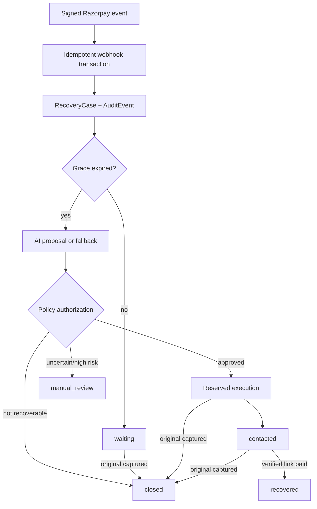

# RecoverAI architecture

## Authority model

The AI is advisory. It receives minimal non-PII context and returns a bounded `RecoveryDecision`. Zod validates the shape; policy checks grace expiry, terminal states, currency, amount, contact availability, approval threshold, attempt limit, link enablement, and prohibited credential language. Only the executor can create a Payment Link or enqueue a notification.

## State machine

| Current | Allowed next | Trigger |
|---|---|---|
| `waiting` | `eligible`, `manual_review`, `closed` | grace expiry, escalation, original capture |
| `eligible` | `contacted`, `manual_review`, `closed` | execution, escalation, stop rule |
| `contacted` | `recovered`, `manual_review`, `closed` | verified link payment, contradiction, stop rule |
| `manual_review` | `contacted`, `recovered`, `closed` | explicit operator/provider outcome |
| `recovered` | `recovered` | terminal/idempotent |
| `closed` | `closed` | terminal/idempotent |

## Persistence and concurrency

- `WebhookReceipt.eventKey` is unique; duplicate completed receipts return `200` and `duplicate=true`.
- Supported event receipt, domain, audit, and outcome writes share one transaction.
- Processing failure returns `500` with no partial state so Razorpay can retry.
- Execution reserves a case transactionally before an external call.
- Outbox dedupe keys and stable Payment Link references protect downstream actions.
- Late capture updates the case and its stop/prevention audits transactionally.
- Paid-link amount or currency contradictions go to `manual_review`, never revenue.

SQLite is scoped to the local Buildathon implementation. Multi-instance production must use managed PostgreSQL and revalidate isolation under provider retries.

## Trust boundaries

| Boundary | Controls |
|---|---|
| Razorpay → webhook | Constant-time HMAC, Zod schema, stable idempotency key |
| Server → AI | No name, email, phone, credentials, signature, or payment ID in prompt |
| Server → Razorpay | Test mode, policy approval, stable reference, exact money fields |
| Server → dashboard | Masked identity, redacted metadata, no secrets or link URL |
| Dashboard → demo API | Strict seed/reset body, demo-mode gate, serialized replay |

Secrets remain server-side. Logs omit payloads, signatures, customer data, and raw errors. Customer text is sanitized again at the outbox boundary.

## Threat model

| Risk | Mitigation | Production gap |
|---|---|---|
| Forged/replayed webhook | Signature plus unique receipt | Secret rotation runbook |
| Duplicate collection | Grace window and late-capture stop | Provider reconciliation job |
| Unsafe model output | Minimal prompt, schema, guardrails, fallback | Formal model red-team evaluation |
| Concurrent action | Reservation transaction and dedupe IDs | PostgreSQL load/isolation tests |
| Inflated revenue | Verified event and exact amount/currency | Settlement reconciliation |
| PII leakage | Masked API, redaction, no query logging | Auth, tenant controls, retention policy |
| Public endpoint abuse | Strict bounded schemas | Rate limiting/WAF and authentication |

## Failure behavior

| Failure | Behavior |
|---|---|
| Invalid signature | `401`, no persistence |
| Database mutation failure | rollback and `500` |
| Invalid/unavailable AI | audited deterministic fallback |
| Payment Link failure | provider-error audit; no revenue |
| Original late capture | close, stop, count duplicate prevention |
| Paid-link amount/currency mismatch | atomic manual review and safe audits |
| Attempt limit, opt-out, expiry | stop without another notification |

## Hosted judge preview

`HOSTED_DEMO_MODE=true` serves the exact versioned 60-case result from code without mutating SQLite. This keeps the Vercel dashboard reliable on an ephemeral serverless filesystem while preserving the full local persistence path. Hosted Replay resets presentation state only, remains explicitly synthetic, and returns `reused=true`.

This is not the production architecture. Durable deployment requires PostgreSQL, authenticated tenant isolation, scheduler/queue, delivery worker, reconciliation, monitoring, backups, and an approved retention policy.
